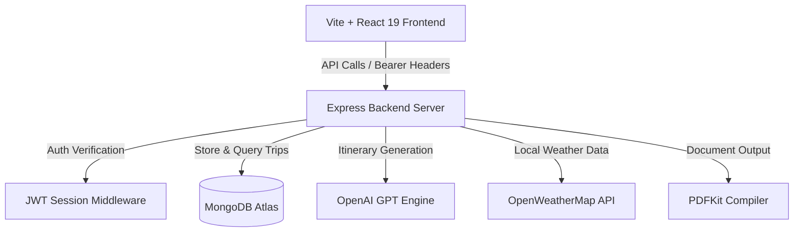

# ✈️ TripCraft AI — Premium Personalized Travel Planner

TripCraft AI is a premium, agency-quality, AI-powered travel planner built on the MERN stack. It features a highly interactive, animated, scroll-driven user interface inspired by premium SaaS landing pages (like Stripe, Linear, or Framer).

Users enter a destination, dates, budget, travelers, and interests, and the AI generates a bespoke day-by-day itinerary with activities, timings, category tags, and estimated costs. Users can manage budgets, drag-and-drop activities between days, add manual items, export to PDF, view local weather, and share plans via email.

---

## 🚀 Key Features

*   **🤖 AI-Powered Itineraries**: Instantly maps destination hotspots, dining options, and structured routes day-by-day.
*   **🌦️ Live Destination Weather**: Integrated OpenWeatherMap widget showing current temperature, wind speed, humidity, and condition descriptions with automatic offline mocks.
*   **🗺️ Interactive Google Maps**: Built-in interactive map dynamically loaded for the chosen destination.
*   **🔑 Secure Local & OAuth Authentication**: Support for JWT-based email/password registration with strict password rules, alongside simulated Google & GitHub OAuth logins.
*   **📊 Budget Dashboard & Analytics**: Dynamic budget indicators, category breakdowns, and Recharts pie-charts tracking your expenses.
*   **📋 Drag-and-Drop Editor**: Rearrange activities or move events between days using a smooth dragging layout.
*   **✉️ Itinerary Sharing**: Copy secure shareable links to your clipboard or trigger email confirmations to co-travelers.
*   **📄 PDF Document Export**: Generates and downloads a custom, clean PDF document of the itinerary directly from the backend.

---

## 🛠️ Architecture



---

## 📦 Directory Structure

```text
├── backend/                  # Node.js + Express Backend Server
│   ├── config/               # Database and configuration files
│   ├── controllers/          # Controllers (auth, trip, AI)
│   ├── middleware/           # Auth, validation, and error middlewares
│   ├── models/               # MongoDB Mongoose schemas
│   ├── routes/               # API endpoint routing
│   └── utils/                # Helper utilities (token cookies, PDF)
├── src/                      # Frontend Source Files (Vite Root)
│   ├── components/           # UI and sub-components (planner, charts)
│   ├── context/              # Authentication context providers
│   ├── pages/                # App Views (Landing, Create, Detail, Auth)
│   └── utils/                # Axios API configuration
├── index.html                # Entry HTML file
├── vite.config.js            # Vite bundler options
└── package.json              # Main project dependencies
```

---

## ⚙️ Installation & Setup

### 1. Database & External APIs Configuration
Create a `.env` file inside the `backend/` folder and configure the following parameters:
```env
PORT=5000
MONGO_URI=mongodb+srv://<username>:<password>@cluster.mongodb.net/tripcraft
JWT_SECRET=your_jwt_secret_key_here
OPENAI_API_KEY=your_openai_api_key_here
WEATHER_API_KEY=your_openweather_api_key_here
CLIENT_URL=http://127.0.0.1:5173
```

---

### 2. Run the Application Locally

#### Start the Backend Server:
```bash
cd backend
npm install
npm run dev
```

#### Start the Frontend Server:
Open a new terminal window in the root directory:
```bash
npm install
npm run dev
```
Navigate to **`http://127.0.0.1:5173/`** to view your application!

---

## 📡 API Reference

### Authentication Endpoints
*   `POST /api/auth/register` - Create a new account.
*   `POST /api/auth/login` - Login to an account.
*   `POST /api/auth/refresh` - Refresh access tokens.
*   `GET /api/auth/me` - Fetch profile metadata for the active session.

### Trip Endpoints
*   `POST /api/trips` - Create a draft trip.
*   `GET /api/trips` - Fetch all trips for the logged-in user.
*   `GET /api/trips/:id` - Fetch trip details by ID.
*   `PUT /api/trips/:id` - Update trip activities or details.
*   `DELETE /api/trips/:id` - Delete a trip.
*   `POST /api/trips/:id/generate-itinerary` - Generate/regenerate itinerary with AI.
*   `GET /api/trips/:id/weather` - Fetch destination weather details.
*   `POST /api/trips/:id/share-email` - Share itinerary via email.
*   `GET /api/trips/:id/export-pdf` - Download compiled PDF file.